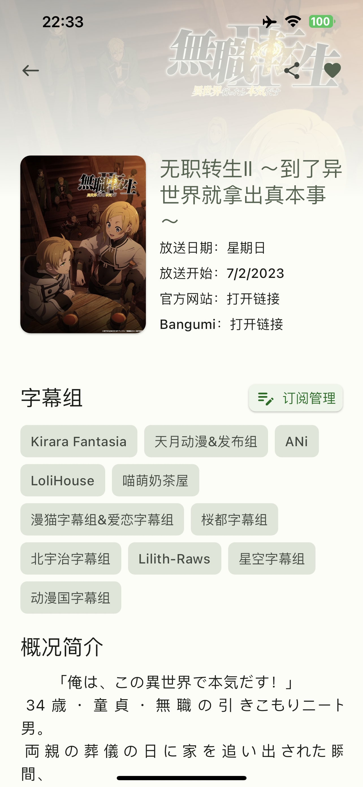
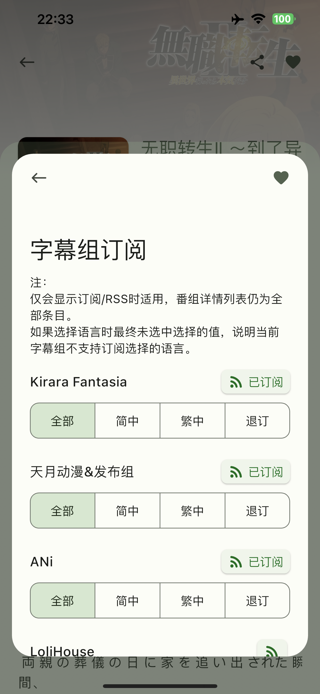
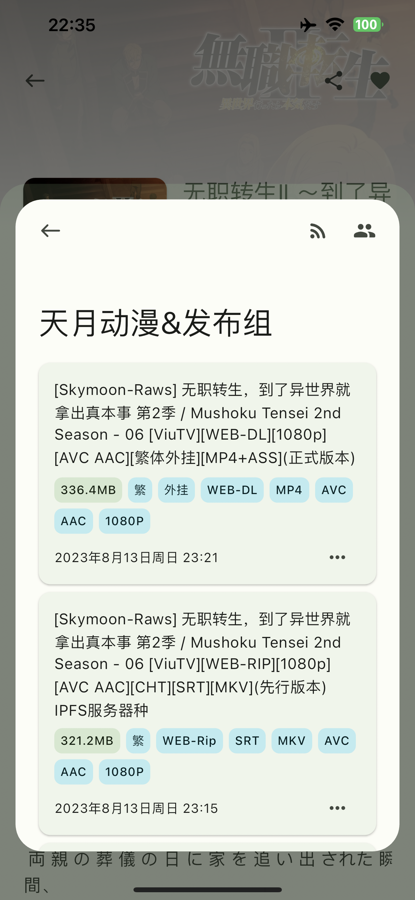
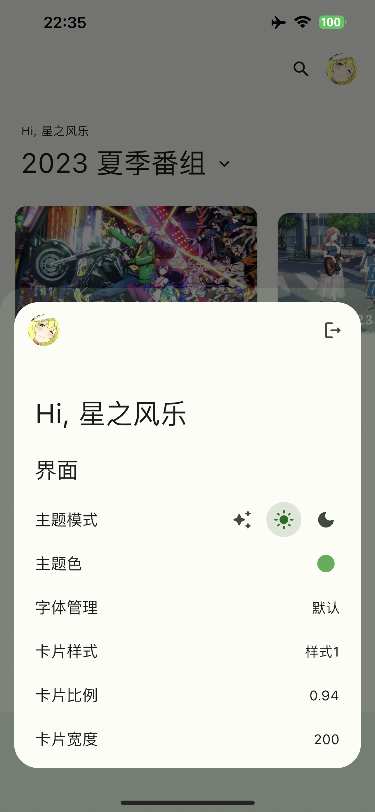
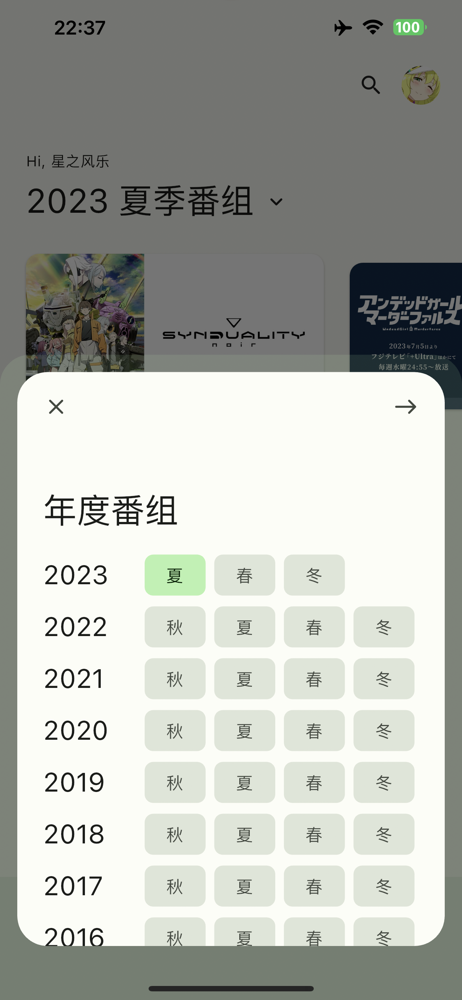
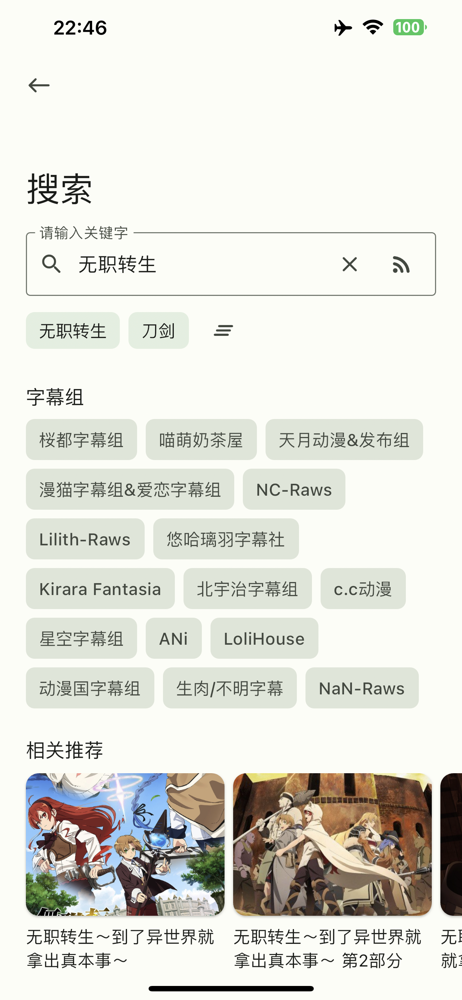

# Mikan Project

        [](https://app.codacy.com/gh/iota9star/mikan_flutter?utm_source=github.com&utm_medium=referral&utm_content=iota9star/mikan_flutter&utm_campaign=Badge_Grade)

](static/art/banner.png)

[mikanani.me](https://mikanani.me)


## Download

<a href="https://play.google.com/store/apps/details?id=io.nichijou.flutter.mikan" target="_blank"></a>

[**从 Github 下载**](https://github.com/iota9star/mikan_flutter/releases/latest)

## Stars

[](https://stars.medv.io/iota9star/mikan_flutter)

**如果本项目对你有所帮助的话，可以 `star` 支持一下，谢谢**

## Screenshot  

<table>
  <tr>
    <td></td>
    <td></td>
    <td></td>
  <tr>
  <tr>
    <td></td>
    <td></td>
    <td></td>
  <tr>
  <tr>
    <td></td>
    <td></td>
    <td></td>
  <tr>
  <tr>
    <td></td>
    <td></td>
    <td></td>
  <tr>
  <tr>
    <td></td>
    <td></td>
    <td></td>
  <tr>
</table>

## Thanks

特别感谢 [JetBrains](https://www.jetbrains.com/?from=mikan_flutter)
提供的 [IntelliJ IDEA](https://www.jetbrains.com/idea)
等全家桶对开源项目的支持.

[](https://www.jetbrains.com/?from=mikan_flutter)

## Licenses

该项目使用 `Apache License 2.0` 协议，仅供学习交流，请于下载后24小时内删除，使用应遵循当地法律法规，请勿用于违法用途。

``` text
Copyright 2020. iota9star@nichijou.io

Licensed under the Apache License, Version 2.0 (the "License");
you may not use this file except in compliance with the License.
You may obtain a copy of the License at

    https://www.apache.org/licenses/LICENSE-2.0

Unless required by applicable law or agreed to in writing, software
distributed under the License is distributed on an "AS IS" BASIS,
WITHOUT WARRANTIES OR CONDITIONS OF ANY KIND, either express or implied.
See the License for the specific language governing permissions and
limitations under the License.
```
