# 蜜柑计划

[](https://gitter.im/iota9star/mikan?utm_source=badge&utm_medium=badge&utm_campaign=pr-badge)        [](https://app.codacy.com/gh/iota9star/mikan_flutter?utm_source=github.com&utm_medium=referral&utm_content=iota9star/mikan_flutter&utm_campaign=Badge_Grade)


[mikanani.me](https://mikanani.me)

## Getting Started

This project is a starting point for a Flutter application.

A few resources to get you started if this is your first Flutter project:

- [Lab: Write your first Flutter app](https://flutter.dev/docs/get-started/codelab)
- [Cookbook: Useful Flutter samples](https://flutter.dev/docs/cookbook)

For help getting started with Flutter, view our
[online documentation](https://flutter.dev/docs), which offers tutorials, samples, guidance on mobile development, and a
full API reference.

## Screenshot

| :heart: | :fire: | :sparkles: | :ok_hand: |
| -----| ---- | ---- | ---- |
| 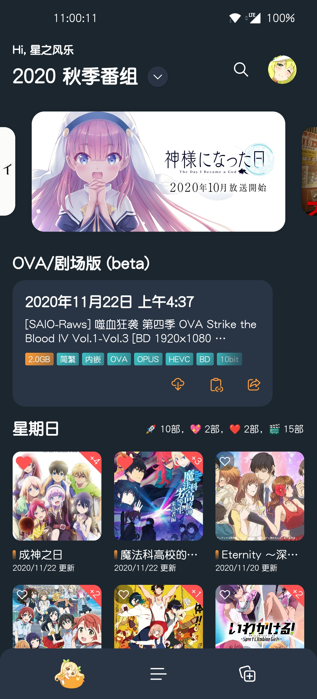 | 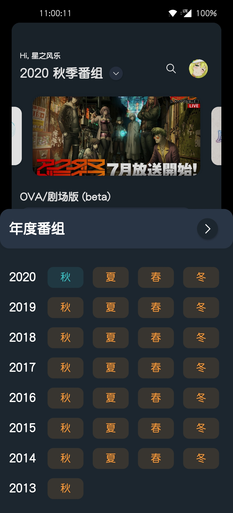 | 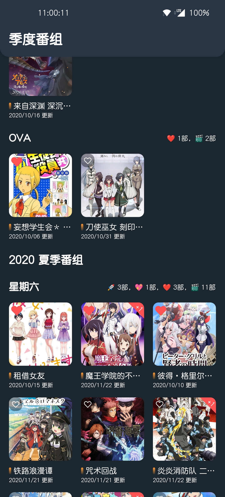 | 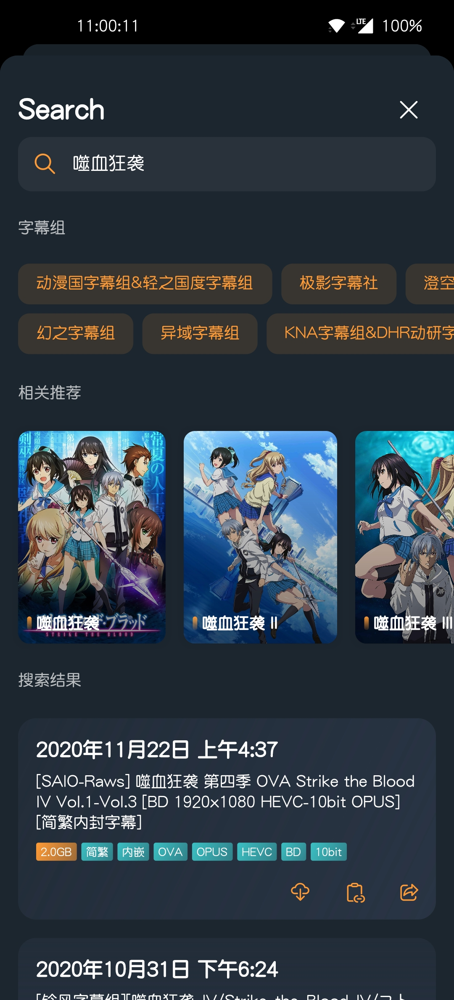 |
| 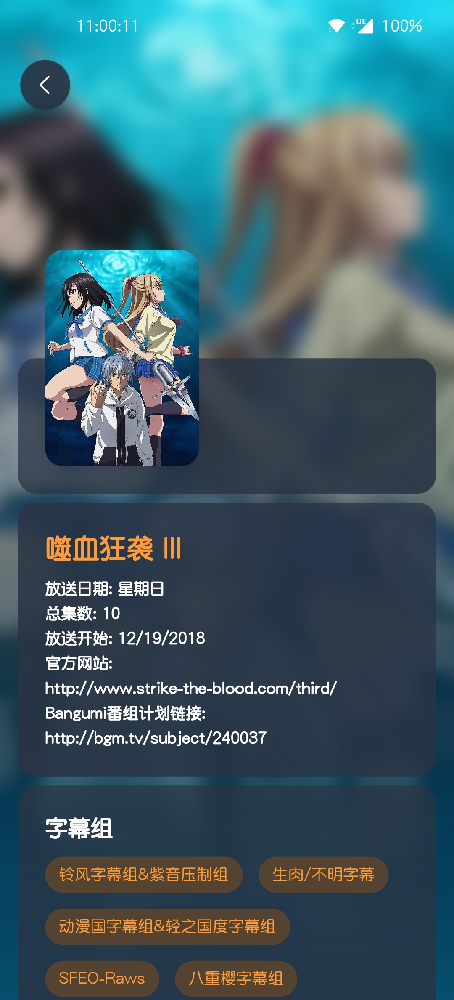 |  | 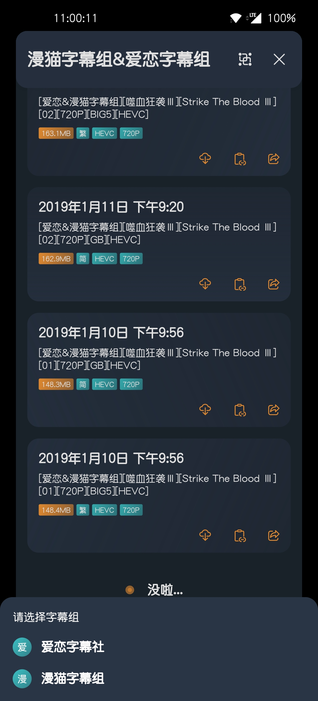 | 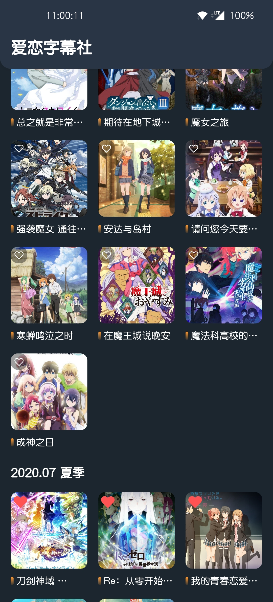 |
| 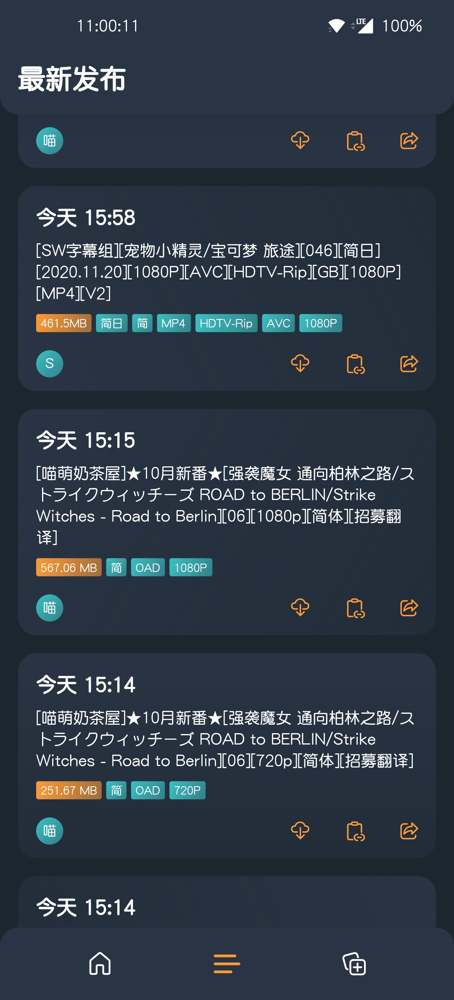 |  |  | 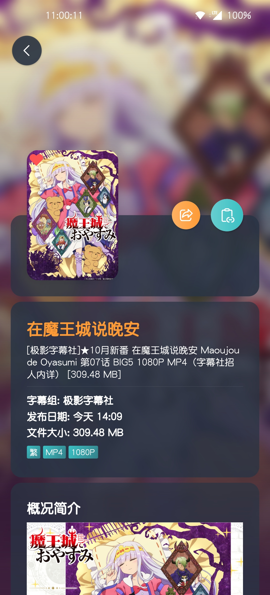 |
| 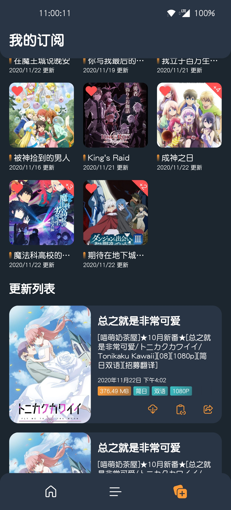 | 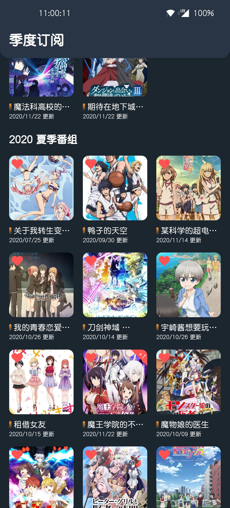 |  | 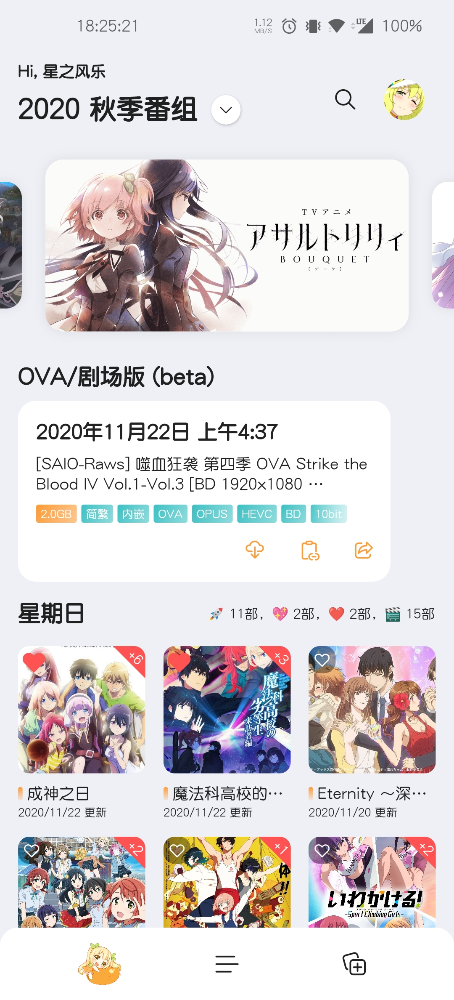 |
| 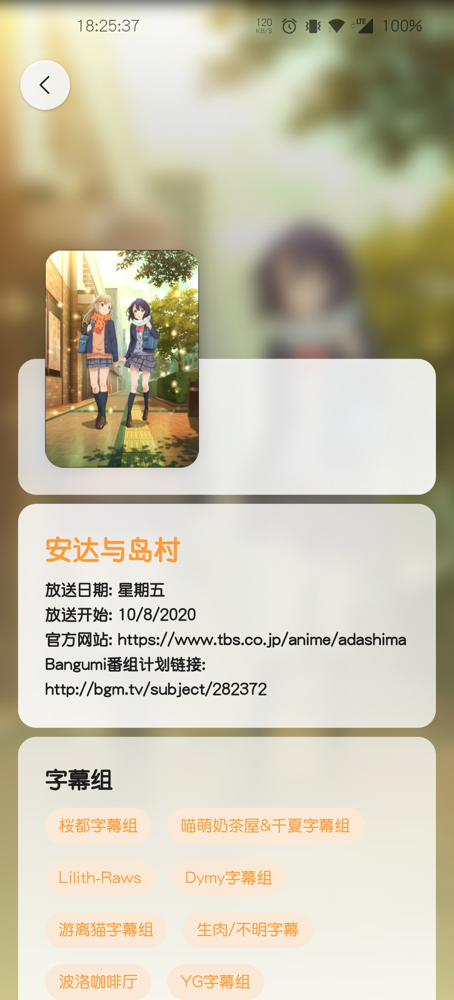 | 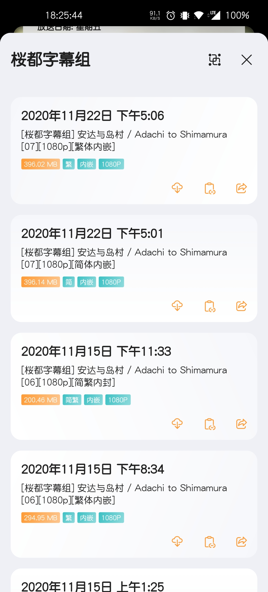 |  |  |
| 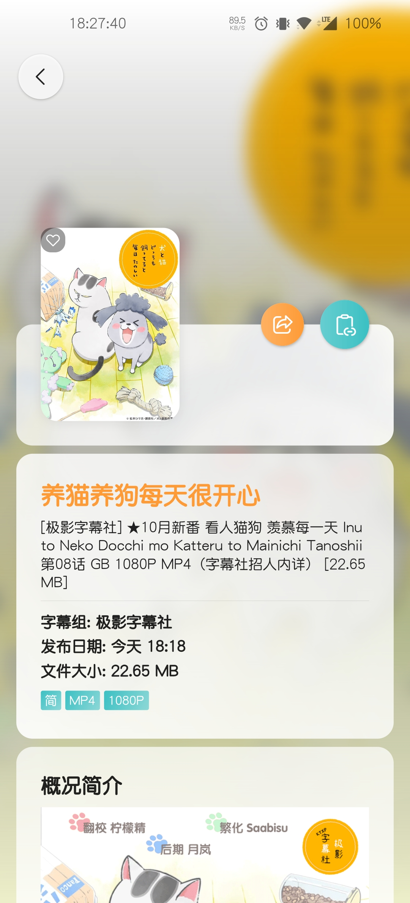 | 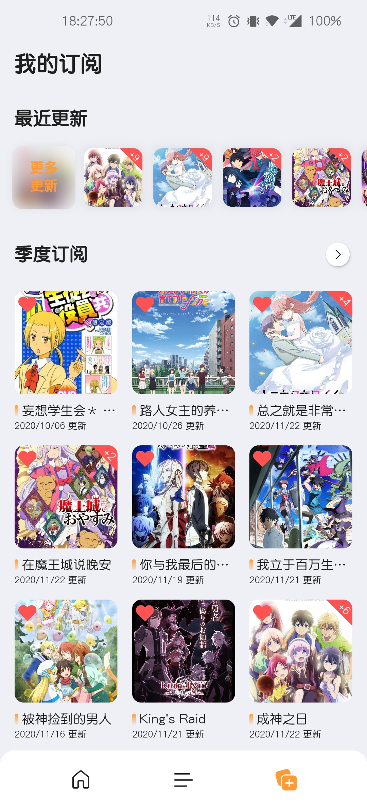 |  |  |

## Thanks

特别感谢 [JetBrains](https://www.jetbrains.com/?from=mikan_flutter) 提供的 [IntelliJ IDEA](https://www.jetbrains.com/idea)
等全家桶对开源项目的支持.

[](https://www.jetbrains.com/?from=mikan_flutter)

## Licenses

该项目使用 `Apache License 2.0` 协议，仅供学习交流，使用应遵循当地法律法规，请勿用于违法用途。

``` text
   Copyright 2020. iota9star@nichijou.io

   Licensed under the Apache License, Version 2.0 (the "License");
   you may not use this file except in compliance with the License.
   You may obtain a copy of the License at

       http://www.apache.org/licenses/LICENSE-2.0

   Unless required by applicable law or agreed to in writing, software
   distributed under the License is distributed on an "AS IS" BASIS,
   WITHOUT WARRANTIES OR CONDITIONS OF ANY KIND, either express or implied.
   See the License for the specific language governing permissions and
   limitations under the License.
```
